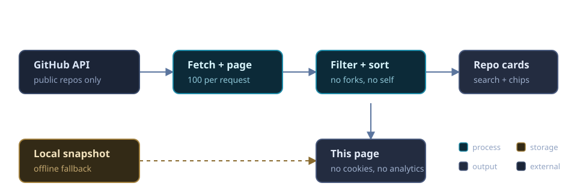

<!-- Cyberpunk Banner -->
<div align="center">
  
</div>

<h1 align="center">
  
</h1>

<p align="center">
  <a href="https://shaiinarab.github.io/shahinarab78/" target="_blank"></a>
  <a href="https://github.com/Shaiinarab/shahinarab78/actions/workflows/deploy-pages.yml"></a>
</p>

> 🗂️ **This repository is also my website** — a live repo hub that auto-syncs every public repository from the GitHub API: searchable, filterable, always current.

<details>
<summary><strong>⚙️ How this repo works</strong> — one page, one API, zero trackers</summary>
<br/>



- **`index.html` + `assets/`** — the hub itself. No build step, no framework, no cookies.
- **Live sync** — your browser calls the GitHub API on every visit; new repos appear without a redeploy. Rate-limited or offline? A cached snapshot from your last visit takes over.
- **Privacy by construction** — public data only, forks and this repo filtered out, nothing stored on a server.
- **Deploy** — every push to `main` ships the site files to GitHub Pages via `.github/workflows/deploy-pages.yml`.

</details>

---

## 🌑 **THE ARCHITECT** 

```rust
mod shahin_arab {
    pub struct Human {
        pub location: &'static str,        // "Shiraz, Iran 🇮🇷"
        pub archetype: &'static str,       // "INTP • AuDHD • Eternal Student"
        pub languages: Vec<&'static str>,  // ["Persian", "English"]
        pub passion_stack: Vec<&'static str>,
        pub mission: &'static str,
    }

    impl Human {
        pub fn new() -> Self {
            Self {
                location: "Shiraz, Iran 🇮🇷",
                archetype: "INTP • AuDHD • Eternal Student",
                languages: vec!["Persian 🔱", "English 🦅"],
                passion_stack: vec![
                    "Rust 🦀", "Zig ⚡", "Go 🐹", "Python 🐍", "Mojo 🔥",
                    "Linux 🐧", "GPU Computing 🎮", "CUDA/OpenCL",
                    "Cybersecurity 🛡️", "OS Optimization ⚙️"
                ],
                mission: "💰 Make money → Buy freedom → Transcend limits",
            }
        }

        pub fn mantra(&self) -> &'static str {
            "🌌 Even the sky is not a limit... YOU are the limit."
        }

        pub fn vibe(&self) -> &'static str {
            "🌃 Cyberpunk • Neon • Dark Symbolism • Occult Aesthetic"
        }
    }
}
```

> *"Let's not talk. Share music and feelings."* 🎧🖤

---

## 🔮 **CURRENT QUESTS**

| # | Project | Description | Stack |
|---|---------|-------------|-------|
| **01** | **[Oduverse → mashreghi_asil](https://github.com/Shaiinarab/mashreghi_asil)** | 🌸 E-commerce perfume online shop | Next.js + Rust + WASM |
| **02** | **NeuroSymphonia** | 🎵 Music-based therapeutic rhythmic mobile game | Healing through rhythm & code |
| **03** | **Nimrooz VPN** | 🛡️ Rust-based VPN client for all protocols | Freedom through encryption |
| **04** | **Music Sanctuary** | 🎼 Real Rap • EDM • Nu-Metal • Jazz • Iranian Folklore | The soundtrack of my soul |

---

## ⚗️ **ALCHEMY & SUBSTANCES**

<div align="center">

| ☕ | 🌿 | 🍄 |
|----|----|----|
| **Arabica Coffee** | **Sativa Cannabis** | **Psilocybin Mushrooms** |
| *Fuel for the mind* | *Creative expansion* | *Consciousness exploration* |

</div>

---

## 🛠️ **TECH ARSENAL**

<p align="center">
  <strong>⚔️ Languages of Power:</strong><br/>
  
  
  
  
  
  
  <br/><br/>
  
  <strong>🐧 Operating Systems & Infrastructure:</strong><br/>
  
  
  
  
  
  <br/><br/>
  
  <strong>🛡️ Security & Research:</strong><br/>
  
  
  
</p>

---

## 🎭 **THE PARADOX**

> 🧠 **Knows everything about computers**<br>
> 💻 **Never coded for money**<br>
> 🎓 **Eternal student, forever learning**<br>
> 🌊 **AuDHD • INTP • Persian/English Bilingual**

*I exist in the space between knowing and doing, between theory and practice, between the digital and the mystical.*

---

## 📊 **GITHUB STATISTICS**

<div align="center">
  <table>
    <tr>
      <td>
        <a href="https://github.com/Shaiinarab"></a>
      </td>
      <td>
        <a href="https://github.com/Shaiinarab?tab=repositories"></a>
      </td>
    </tr>
  </table>
  
  <br/>
  
  <!-- Streak Stats -->
  <a href="https://github.com/Shaiinarab"></a>
  
  <br/><br/>
  
  <!-- Contribution Graph -->
  <a href="https://github.com/Shaiinarab"></a>
</div>

---

## 🏆 **TROPHIES & ACHIEVEMENTS**

<p align="center">
  <a href="https://github.com/Shaiinarab"></a>
</p>

---

## 🌐 **CONNECT IF YOU DARE**

<p align="center">
  <a href="https://www.linkedin.com/in/shaiinarab/" target="_blank">
    
  </a>
  <a href="https://twitter.com/shaiinarab" target="_blank">
    
  </a>
  <a href="mailto:Shahinarab619@outlook.com">
    
  </a>
  <a href="https://github.com/shaiinarab" target="_blank">
    
  </a>
</p>

> 🎵 **Instead of talking, send me your favorite track.**<br>
> 🎧 *Music speaks what cannot be expressed.*

---

## 👁️ **YOU ARE WATCHER #**

<div align="center">
  <a href="https://github.com/Shaiinarab"></a>
</div>

---

<div align="center">

## 🌑 **FINAL TRANSMISSION**


> **"Even the sky is not a limit. YOU are the limit."**<br>
> 🌃 Made with 🖤, ☕, 🎵, and ✨ by **Shahin Arab**<br>
> 🇮🇷 Shiraz, Iran • Eternal Student • Open Source Soul

</div>

---
